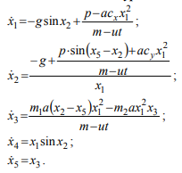
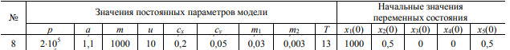
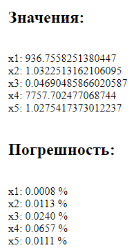
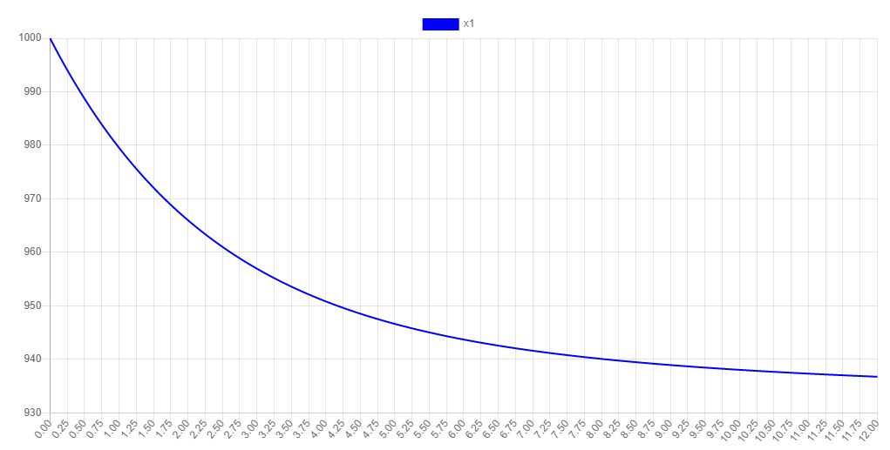
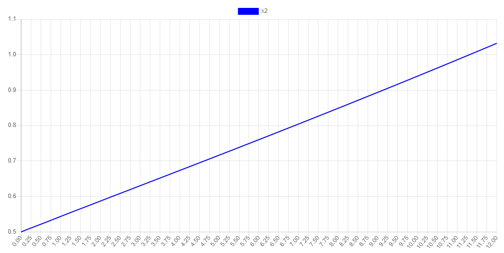
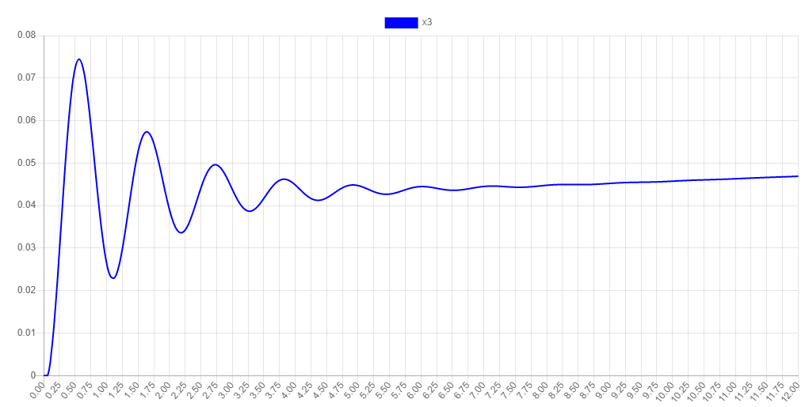
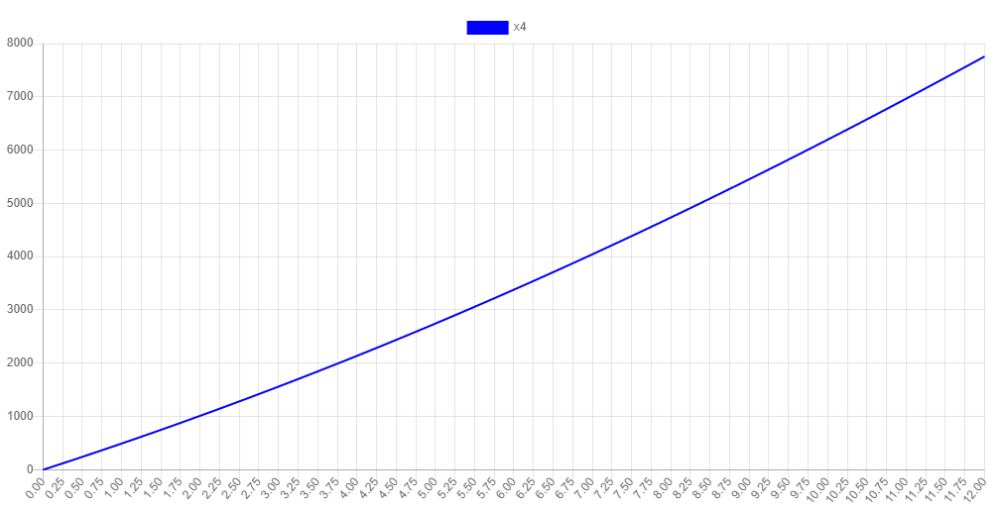
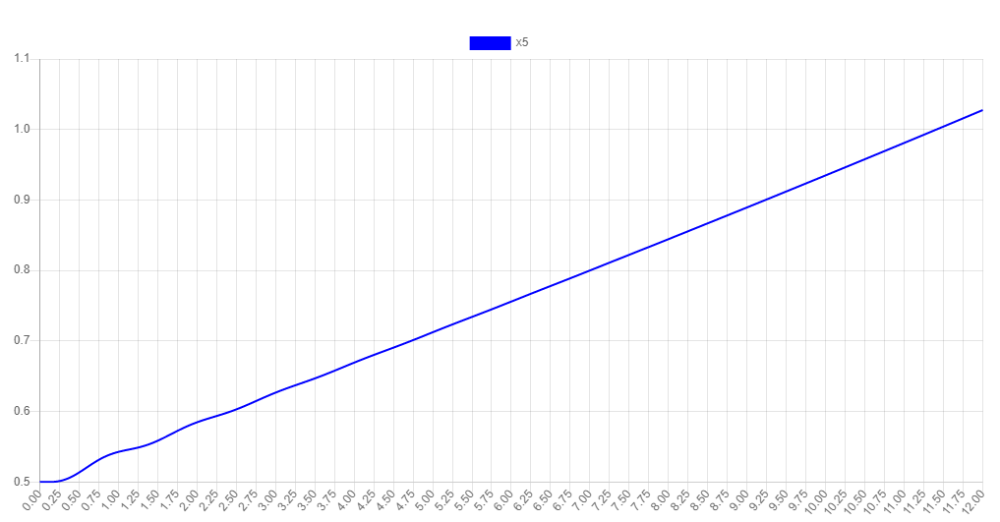

### Задание:
Решение системы дифференциальных уравнений на интервале [0; T]  

### Параметры:  
  

------

При величине шага h = 0.0625 получаем следующие значения и относительные погрешнсти:  

  

------

### Графики ф-ций h = 0.0625

  
  
  
  
  
